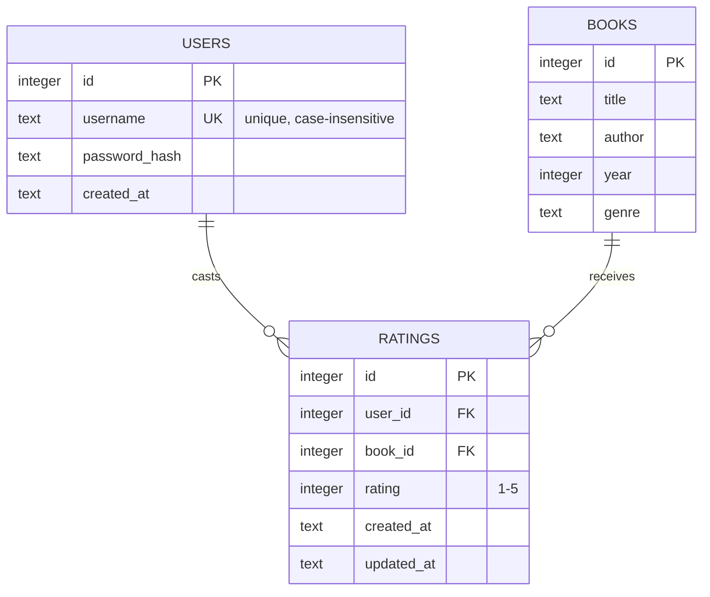
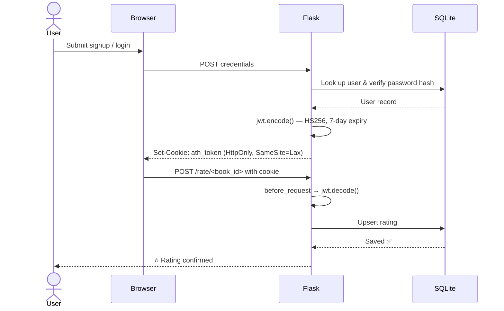

````markdown
<div align="center">

# 📚 Athenaeum

**A personal library collection manager with global book search,<br>JWT authentication, and star ratings.**


*Search real books · Save favorites · Rate with stars · Dark mode built in*

</div>

---

## 🖼️ Screenshots

<!-- Drop your screenshots into a /docs folder, then update the paths below -->
<!-- | Catalog | Global Search | Details & Ratings | -->
<!-- |---|---|---| -->
<!-- |  |  |  | -->

---

## ✨ Features

| | Feature | What you get |
|:---:|---|---|
| 📖 | **Full CRUD Catalog** | Add, edit, and delete books — title, author, year, genre |
| 🔍 | **Instant Library Search** | Case-insensitive title search + sort by publication year |
| 🌐 | **Global Database Search** | Find real books via the [Open Library API](https://openlibrary.org/developers/api), filtered by genre |
| 🖼️ | **Rich Book Details** | Cover art, landscape detail view, and fetched descriptions |
| ❤️ | **Favorites** | Save any discovery with one click |
| 🗂️ | **Collections** | Group saved books into named collections with safe deletion |
| 🔐 | **JWT Authentication** | Signup / login / logout with HttpOnly cookie tokens |
| ⭐ | **Star Ratings** | Logged-in users rate 1–5; live averages shown to everyone |
| 🌗 | **Dark / Light Theme** | Persists across visits |
| ⌨️ | **Keyboard Shortcuts** | `/`, `Ctrl/Cmd+K`, `Enter`, `Esc` |
| 💬 | **Toast Notifications** | Dismissible flash messages that auto-hide |
| ♿ | **Accessible & Responsive** | ARIA labels, `aria-live` regions, reduced-motion support, flip-to-fit dropdowns |

---

## 🛠️ Tech Stack

| Layer | Technology |
|---|---|
| Backend |   |
| Database |  via the standard `sqlite3` module |
| Auth |  + Werkzeug password hashing |
| Frontend | Vanilla HTML / CSS / JS with Jinja2 — **no ORM, no framework, no build step** |
| External API | [Open Library](https://openlibrary.org) — search, covers, descriptions |

---

## 🚀 Quick Start

> [!NOTE]
> The SQLite database — including the `users` and `ratings` tables — is created and migrated **automatically** on first run. No manual setup required.

```bash
git clone <your-repo-url> athenaeum
cd athenaeum

python -m venv venv
source venv/bin/activate          # Windows: venv\Scripts\activate

pip install -r requirements.txt
python app.py
```

Then open **http://127.0.0.1:5000** 🎉

---

## ⚙️ Configuration

| Variable | Default | Purpose |
|---|---|---|
| `SECRET_KEY` | built-in fallback | Flask session/flash signing |
| `JWT_SECRET` | falls back to `SECRET_KEY` | JWT token signing |
| `DB_PATH` | `./library.db` | SQLite database location |
| `FLASK_DEBUG` | `1` | Set to `0` to disable debug mode |
| `HOST` | `127.0.0.1` | Bind address |
| `PORT` | `5000` | Bind port |

> [!WARNING]
> **Before deploying:** set `SECRET_KEY` and `JWT_SECRET` to long random values. With the default keys, tokens can be forged, and they won't survive an app restart.
>
> ```bash
> export SECRET_KEY="$(python -c 'import secrets; print(secrets.token_hex(32))')"
> export JWT_SECRET="$(python -c 'import secrets; print(secrets.token_hex(32))')"
> export FLASK_DEBUG=0
> ```

> [!TIP]
> For production, serve with a real WSGI server instead of `app.run()`:
>
> ```bash
> pip install waitress
> waitress-serve --host=0.0.0.0 --port=5000 app:app
> ```

---

## 📖 Usage Guide

1. 📚 **Browse your catalog** — every book with year, genre, and community ratings.
2. ➕ **Add books** — *Manual Entry* for quick input, or *Find Real Books* to search Open Library. Click any result for cover art and a description, then **Add to Library**.
3. ❤️ **Save favorites** — hit **Favorite** in the details view, then manage collections via the **Saved** button in the header.

   > [!TIP]
   > Favorites and collections are stored in your **browser** (localStorage) — they survive refreshes without an account.
4. 👤 **Create an account** — click **Sign Up** (username: 3–32 chars, password: 6+ chars). You're logged in instantly.
5. ⭐ **Rate books** — hover the stars on any row and click. Re-click to change your rating; averages update for everyone.
6. 🚪 **Log out** — the header button deletes your JWT cookie.

### ⌨️ Keyboard Shortcuts

| Shortcut | Action |
|---|---|
| `/` or `Ctrl/Cmd + K` | Focus library search |
| `Enter` *(in API modal)* | Run global search |
| `Esc` | Close dialogs and dropdowns |

---

## 🗺️ Routes

| Method | Endpoint | Auth | Description |
|:---:|---|:---:|---|
| `GET` | `/` | — | Catalog with `?search=` and `?sort=asc\|desc` |
| `GET/POST` | `/add` | — | Manual book entry |
| `GET/POST` | `/edit/<id>` | — | Edit an existing book |
| `POST` | `/delete/<id>` | — | Delete a book |
| `POST` | `/rate/<book_id>` | ✅ JWT | Rate a book 1–5 (upserts your vote) |
| `GET/POST` | `/signup` | — | Create an account |
| `GET/POST` | `/login` | — | Log in (supports `?next=` redirect) |
| `POST` | `/logout` | — | Clear the auth cookie |

---

## 🗄️ Database Schema



- 🔎 Indexes on `books.title`, `books.year`, `ratings.book_id`, `ratings.user_id` keep search and aggregation fast
- 🔗 `UNIQUE (user_id, book_id)` — one vote per user per book; re-rating upserts
- 🧹 Foreign keys **cascade** — deleting a book automatically removes its ratings

---

## 🔑 Authentication Flow



- Tokens live in **HttpOnly** cookies — JavaScript can never read them
- **SameSite=Lax** blocks most CSRF vectors
- Expired or tampered tokens silently log the user out
- Login errors are **generic** ("Invalid username or password") to prevent user enumeration

---

<details>
<summary>📂 <strong>Project Structure</strong> — click to expand</summary>

<br>

```
athenaeum/
├── app.py                  # Flask app — routes, auth, database
├── requirements.txt        # Python dependencies
├── library.db              # SQLite database (auto-created)
├── templates/
│   ├── index.html          # Catalog, API search modal, favorites modal
│   ├── add.html            # Manual book entry
│   ├── edit.html           # Edit existing book
│   ├── login.html          # Log in
│   └── signup.html         # Create account
└── static/
    └── style.css           # All styling — themes, modals, tables, forms
```

</details>

---

<details>
<summary>🧰 <strong>Troubleshooting</strong> — click to expand</summary>

<br>

| Problem | Fix |
|---|---|
| `ModuleNotFoundError: jwt` | `pip install PyJWT` — make sure it's **not** the abandoned `jwt` package (`pip uninstall jwt` first if needed) |
| `no such table: users` | Delete `library.db` and restart — tables auto-create on startup |
| Logged out after every restart | You're on the default dev secret — set `SECRET_KEY` / `JWT_SECRET` (see Configuration) |
| Stars don't respond | You're not logged in — log in to unlock rating |
| API search returns nothing | Open Library may be down or rate-limiting; check your connection and retry |
| Port already in use | `PORT=5001 python app.py` |

</details>

---

## 🔒 Security Overview

> [!IMPORTANT]
> Solid protections for a personal / self-hosted deployment. For a public-facing instance, add **rate limiting** and serve over **HTTPS** (which also upgrades the auth cookie to `Secure`).

- 🛡️ Passwords stored as **salted Werkzeug hashes** — never plain text
- 🎟️ JWTs are **HS256-signed** with a 7-day expiry, in `HttpOnly; SameSite=Lax` cookies
- 🧱 **SQL injection** prevented via parameterized queries everywhere
- 🚫 **XSS** mitigated — user data escaped in JS-rendered views; API descriptions injected as `textContent`, never raw HTML
- 🔗 **Open redirects** blocked — `next` params must be local paths
- ✅ **Server-side validation** mirrors client-side checks (username pattern, year range, rating bounds)

---

## 🤝 Contributing

PRs are welcome! Ideas for the roadmap: rating comments/reviews, per-user shelves, export to CSV/Goodreads, and cover uploads for manual entries.

---

## 📄 License

> [!NOTE]
> Add your preferred license here (e.g., MIT) and update the badge at the top to match.

---

<div align="center">

**📚 Athenaeum** — built with Flask, SQLite, and a love of books.

*If it earned a spot on your shelf, give it a star* ⭐

</div>
````